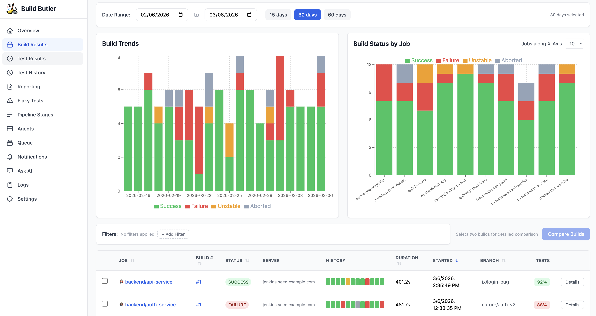

<p align="center">
  
</p>

# Build Butler GitHub Action

[](https://github.com/marketplace/actions/build-butler)
[](https://github.com/railflow/buildbutler-action/actions/workflows/ci.yml)
[](https://github.com/railflow/buildbutler-action/releases)
[](LICENSE)

> Report build results, test outcomes, and runner fleet health to [Build Butler](https://buildbutler.dev) — your CI analytics platform.

---

## Overview

The **Build Butler** GitHub Action automatically captures and ships data from every workflow run to your Build Butler dashboard:

- **Build status** — job name, run number, branch, conclusion, duration
- **Test results** — JUnit XML parsed and sent as structured test suites
- **Runner fleet** — self-hosted runner status (BUILDING → ONLINE lifecycle)



> _Screenshot: Build Butler dashboard showing build trends, test pass rates, and runner utilisation._

---

## Quick Start

```yaml
# .github/workflows/ci.yml
name: CI

on: [push, pull_request]

jobs:
  build:
    runs-on: ubuntu-latest
    steps:
      - uses: actions/checkout@v4

      - name: Build & test
        run: ./gradlew test

      - name: Report to Build Butler
        if: always()   # run even on failure so you capture broken builds
        uses: railflow/buildbutler-action@v1
        with:
          api-key: ${{ secrets.BUILDBUTLER_API_KEY }}
          test-results: 'build/test-results/**/*.xml'
```

---

## Inputs

| Input | Required | Default | Description |
|-------|----------|---------|-------------|
| `api-key` | **Yes** | — | Your Build Butler API key. Store as a [repository secret](https://docs.github.com/en/actions/security-guides/encrypted-secrets). |
| `test-results` | No | `''` | Glob pattern for JUnit XML files (e.g. `build/test-results/**/*.xml`, `**/TEST-*.xml`). Omit to skip test reporting. |
| `status` | No | `''` | Override the build conclusion (`success`, `failure`, `cancelled`). Auto-detected from the job context if omitted. |
| `github-token` | No | `''` | **Self-hosted runners only.** Not needed for GitHub-hosted (cloud) runners. Provides fleet-wide runner reporting (see [Runner Fleet Reporting](#runner-fleet-reporting)). |

---

## Usage Examples

### Minimal — build status only

```yaml
- uses: railflow/buildbutler-action@v1
  if: always()
  with:
    api-key: ${{ secrets.BUILDBUTLER_API_KEY }}
```

### With test results

```yaml
- name: Run tests
  run: mvn test

- uses: railflow/buildbutler-action@v1
  if: always()
  with:
    api-key: ${{ secrets.BUILDBUTLER_API_KEY }}
    test-results: '**/surefire-reports/*.xml'
```

### With full runner fleet reporting

```yaml
- uses: railflow/buildbutler-action@v1
  if: always()
  with:
    api-key: ${{ secrets.BUILDBUTLER_API_KEY }}
    test-results: 'build/test-results/**/*.xml'
    github-token: ${{ secrets.GH_RUNNERS_PAT }}
```

### Matrix builds

```yaml
jobs:
  test:
    strategy:
      matrix:
        java: [11, 17, 21]
    steps:
      - run: ./gradlew test
      - uses: railflow/buildbutler-action@v1
        if: always()
        with:
          api-key: ${{ secrets.BUILDBUTLER_API_KEY }}
          test-results: 'build/test-results/**/*.xml'
```

Each matrix leg is reported as a separate build — Build Butler groups them by workflow run.

---

## Runner Fleet Reporting

> **Using GitHub-hosted (cloud) runners? Skip this section** — `github-token` is not required and runner fleet reporting does not apply.

For **self-hosted runner** setups, the action can report fleet-wide runner status to Build Butler.

Without `github-token`, only the runner executing the current job is reported (status changes from `BUILDING` to `ONLINE` on job completion).

With `github-token`, the action fetches **all** self-hosted runners in your organisation and sends a fleet-wide snapshot.

### Required PAT scopes

| PAT type | Scope | Coverage |
|----------|-------|----------|
| Classic PAT | `manage_runners:org` | All org-level runners (recommended) |
| Classic PAT | `repo` | Repo-level runners only |
| Fine-grained | Self-hosted runners → **Read** | Repo and/or org level |

Create the PAT at **Settings → Developer settings → Personal access tokens**, then add it as a secret (`GH_RUNNERS_PAT`) on your repository or organisation.

---

## Secrets Setup

1. Log in to [buildbutler.dev](https://buildbutler.dev) and copy your API key from **Settings → API Keys**.
2. In your GitHub repository: **Settings → Secrets and variables → Actions → New repository secret**
   - Name: `BUILDBUTLER_API_KEY`
   - Value: your API key
3. _(Optional)_ Add `GH_RUNNERS_PAT` for fleet reporting.

---

## Organisation-wide Reporting (GitHub Enterprise)

GitHub Enterprise allows admins to enforce a workflow across **all repositories automatically** using [Repository Rulesets](https://docs.github.com/en/enterprise-cloud@latest/organizations/managing-organization-settings/managing-rulesets-for-repositories-in-your-organization) — no changes needed in individual repos.

### Step 1 — Create the Build Butler workflow in a central repo

Create a file in a repository that will act as your policy source (e.g. `myorg/workflow-templates`):

```yaml
# .github/workflows/buildbutler.yml
name: Build Butler

on:
  workflow_run:
    workflows: ["*"]
    types: [completed]

jobs:
  report:
    runs-on: ubuntu-latest
    if: always()
    steps:
      - name: Report to Build Butler
        uses: railflow/buildbutler-action@v1
        with:
          api-key: ${{ secrets.BUILDBUTLER_API_KEY }}
```

> The `workflow_run` trigger fires after any workflow completes — success or failure — making it ideal for org-wide reporting without touching individual pipelines.

### Step 2 — Add `BUILDBUTLER_API_KEY` as an org secret

**Org Settings → Secrets and variables → Actions → New organisation secret**
- Name: `BUILDBUTLER_API_KEY`
- Access: all repositories (or select specific ones)

### Step 3 — Enforce via Repository Rulesets

**Org Settings → Rules → Rulesets → New ruleset**
- Target: all repositories (or specific ones)
- Add rule: **Require workflows to pass** → select the workflow from Step 1

Once set, every workflow run across the org is automatically reported to Build Butler — no per-repo changes needed.

---

## How It Works

The action runs in two phases managed by the `post:` hook in `action.yml`:

```
Job starts
  └── main step  → reports build + test results + sets runner to BUILDING
      ...your other steps run...
Job ends (always)
  └── post step  → flips runner status back to ONLINE
```

This ensures runner availability is accurate even when jobs fail or are cancelled.

---

## License

[MIT](LICENSE) © [Railflow](https://railflow.io)
